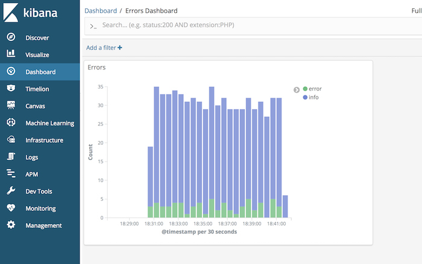

# Go Elasticsearch Logstash Kibana and Filebeat example for golang logs



In this repo you can find example how to work with Elasticsearch and Go together

### Using technologies

- Golang 1.11
- Go Mod for Golang vendor
- Elasticsearch v6.5.1
- Kibana v6.5.1
- Filebeat v6.5.1
- Logstash v6.5.1
- Docker and docker-compose for running

### Service does

1. Run ElasticSearch
2. Run Kibana
3. Run Filebeat
4. Run Logstash
5. Configurate Kibana dashboards
6. Go application sending some test logs

### How to run

1. Clone project: 
```
go get github.com/pcherednichenko/go-elk
```

2. Open to project folder:
```
cd $GOPATH/src/github.com/pcherednichenko/go-elk
```

3. Run services:
```
docker-compose up -d
```

4. Open http://localhost:5601/app/kibana#/dashboard/fa3eb260-0221-11e9-99f0-3b530568b4e6
to see dashboard data